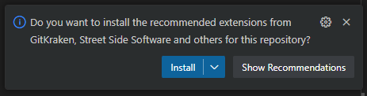

# Welcome to My VSCode Setup for Data Enthusiasts

This repository contains a collection of Visual Studio Code extensions that I recommend for data professionals, including data scientists, data engineers, and analysts.
These may significantly enhance productivity, and provide powerful tools for working and developing with data.

## Getting Started

1. **Clone the Repository**
   Clone this repository and copy the `.vscode` folder into your project directory:

   ```bash
   git clone https://github.com/mvmser/vscode-setup-data.git
   ```

2. **Manual Setup**
   Alternatively, copy the contents of the `.vscode` folder from this repository into your existing VSCode project.

3. **Install Extensions:**
   - **Automatic Installation:** After adding the `.vscode` folder, you should see a pop-up in the bottom-right corner of VSCode asking if you want to install the recommended extensions. Click "Install" to proceed.

   

   - **If No Pop-up Appears:**
     - Open the Extensions view in VSCode (click the Extensions icon or press `Ctrl+Shift+X`) and install the extensions listed in `docs/recommended-extensions.md`.
     - Or run the `install-extensions.ps1` PowerShell script to install all recommended extensions automatically:

       ```powershell
       ./install-extensions.ps1
       ```

## Recommended Extensions

The full list of recommended extensions and their descriptions are available in `docs/recommended-extensions.md`.

## Conclusion

Thank you for using my VSCode setup! I hope these extensions enhance your development experience. Feel free to customize and share your own recommendations.

Happy coding!
